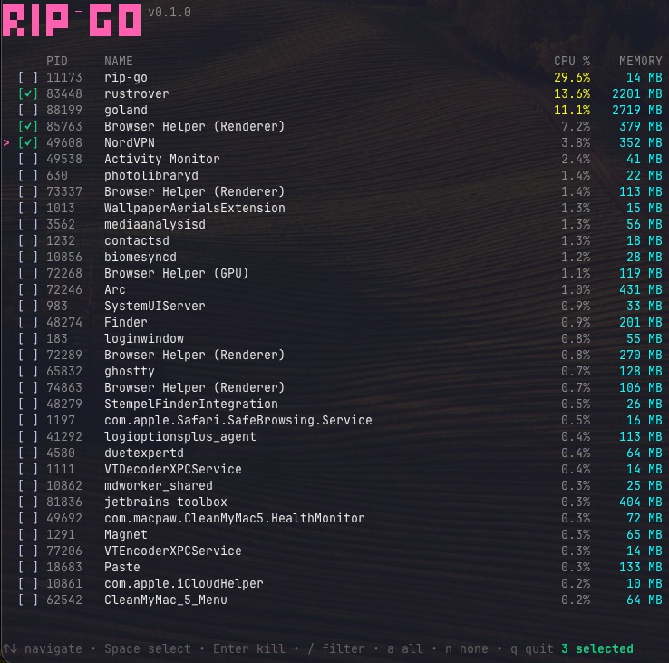

<p align="center">
  
</p>

<p align="center">
  <i>Fuzzy find and kill processes from your terminal</i>
</p>

<p align="center">
  
</p>


<div align="center">
  <h3>Go port of <a href="https://github.com/cesarferreira/rip">rip</a></h3>
</div>

---

This is a Go version of the awesome [rip](https://github.com/cesarferreira/rip) by [@cesarferreira](https://github.com/cesarferreira).

I think the original project is super cool, and I made this port just for fun and practice. All credit goes to the original author.

## Installation

### Homebrew (macOS/Linux)

```bash
brew tap roniel-rhack/tap
brew install rip-go
```

### Go

```bash
go install github.com/roniel-rhack/rip-go/cmd/rip-go@latest
```

### Build from source

```bash
git clone https://github.com/roniel-rhack/rip-go
cd rip-go
make build
./bin/rip-go
```

## Usage

```bash
rip-go                    # List all processes (sorted by CPU)
rip-go -f chrome          # Pre-filter by process name
rip-go -s TERM            # Use SIGTERM instead of SIGKILL
rip-go --sort mem         # Sort by memory usage
```

## Controls

| Key | Action |
|-----|--------|
| `↑` `↓` / `k` `j` | Navigate |
| `Space` | Select/deselect process |
| `Enter` | Kill selected processes |
| `/` | Filter mode |
| `1` | Sort by CPU |
| `2` | Sort by Memory |
| `3` | Sort by PID |
| `4` | Sort by Name |
| `a` | Select all |
| `n` | Deselect all |
| `q` / `Esc` | Quit |

## License

MIT
