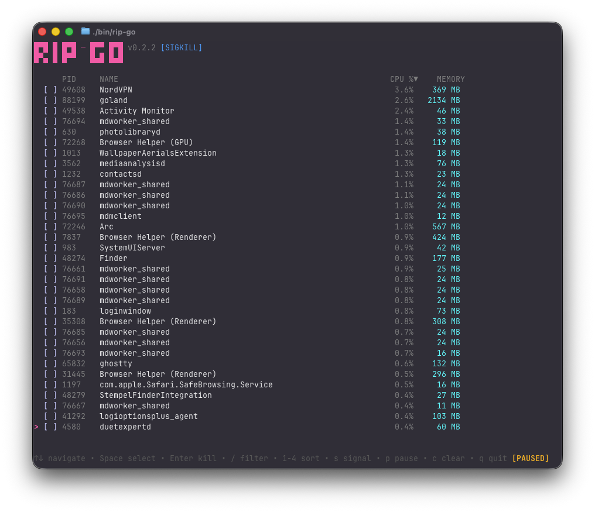

<p align="center">
  
</p>

<p align="center">
  <i>Fuzzy find and kill processes from your terminal with real-time updates</i>
</p>

<p align="center">
  
</p>


<div align="center">
  <h3>Go port of <a href="https://github.com/cesarferreira/rip">rip</a></h3>
</div>

---

This is a Go version of the awesome [rip](https://github.com/cesarferreira/rip)
by [@cesarferreira](https://github.com/cesarferreira).

The original idea and concept belong entirely to [@cesarferreira](https://github.com/cesarferreira). This port builds
upon that foundation by adding additional features like real-time process monitoring, multi-select capabilities, and
runtime signal switching. All credit for the original concept goes to the original author.

## Installation

### Homebrew (macOS/Linux)

```bash
brew tap roniel-rhack/tap
brew install rip-go
```

### Go

```bash
go install github.com/roniel-rhack/rip-go/cmd/rip-go@latest
```

### Build from source

```bash
git clone https://github.com/roniel-rhack/rip-go
cd rip-go
make build
./bin/rip-go
```

## Features

- Real-time process monitoring (updates every second)
- Fuzzy filtering with `/`
- Multi-select processes
- Sort by PID, Name, CPU, or Memory
- Runtime signal switching (KILL, TERM, INT, HUP, QUIT)
- Kill confirmation dialog
- Vim-style navigation

## Usage

```bash
rip-go                    # List all processes (sorted by CPU)
rip-go -s TERM            # Use SIGTERM instead of SIGKILL
rip-go --sort mem         # Sort by memory usage
```

## Controls

| Key | Action |
|-----|--------|
| `↑` `↓` / `k` `j` | Navigate |
| `Space` | Select/deselect process |
| `Enter` | Kill selected (with confirmation) |
| `/` | Filter mode |
| `1` | Sort by PID |
| `2` | Sort by Name |
| `3` | Sort by CPU |
| `4` | Sort by Memory |
| `s` | Cycle signal (KILL→TERM→INT→HUP→QUIT) |
| `a` | Select all |
| `c` | Clear selection |
| `p` | Pause/resume real-time updates |
| `q` / `Esc` | Quit |

## TODO

- [ ] Filter by user (`-u` flag to show only processes from current/specific user)
- [ ] Process tree view (show parent-child hierarchy)
- [ ] Show full command line (not just process name)
- [ ] Search by PID (currently only filters by name)
- [ ] Highlight newly appeared processes

## License

MIT
